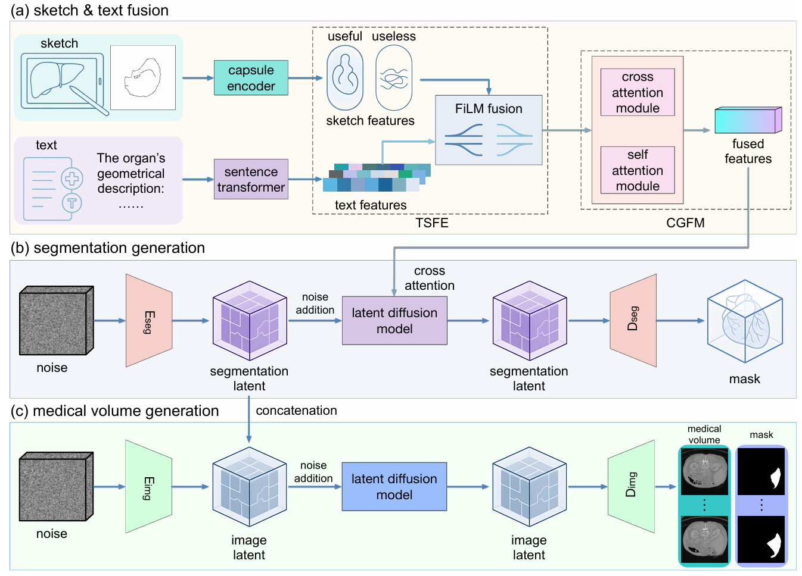
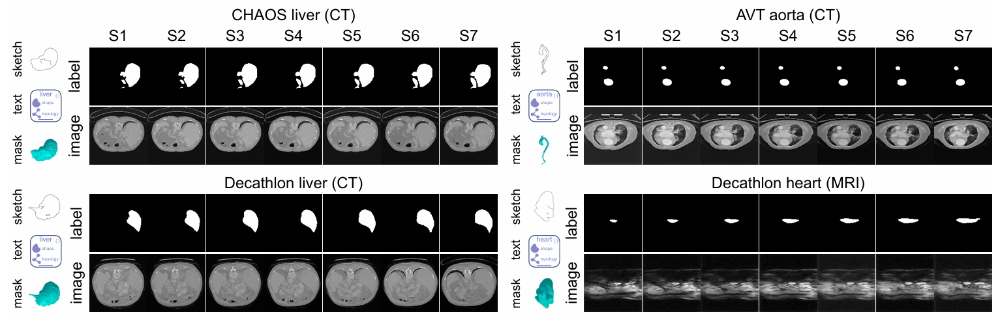

# Sketch2CT: Multimodal Diffusion for Structure-Aware 3D Medical Volume Generation

> Official PyTorch implementation of **Sketch2CT (CVPR 2026)**  
> Multimodal diffusion framework for controllable 3D medical volume synthesis from **sketch + text**

---

## 👨‍🔬 Authors

- **Delin An**
- **Chaoli Wang**

> University of Notre Dame

---

## 📌 Overview

**Sketch2CT** is a multimodal diffusion framework for **structure-aware 3D medical volume generation**, guided by:

- ✏️ **2D sketches** as structural priors
- 📝 **Text descriptions** as geometric semantics

Unlike traditional methods that rely on predefined segmentation masks, Sketch2CT enables **fully controllable and user-driven generation**, producing:

- ✅ 3D segmentation masks
- ✅ Corresponding 3D medical volumes, such as CT or MRI

### 🔑 Key Idea

Sketch2CT decomposes the generation process into two stages:

1. **Segmentation Generation**  
   Sketch + text → 3D segmentation mask

2. **Medical Volume Generation**  
   Segmentation mask → realistic 3D medical volume

This design enables:

- Controllable generation
- Structure preservation
- Low-cost data augmentation

---

## 🧠 Framework

<p align="center">
  
</p>

<p align="center">
  <b>Figure 1.</b> Overview of the Sketch2CT framework. Replace this placeholder with the framework figure from the paper.
</p>

### Core Components

- **TSFE (Text-Sketch Feature Enhancement)**
- **CGFM (Cross-modal Global Fusion Module)**
- **3D Latent Diffusion Models**
- **Capsule-based Attention Backbone**
- **Segmentation-guided Volume Synthesis**

Sketches provide **explicit geometry**, while text provides **high-level semantics**, enabling robust multimodal fusion for anatomically coherent 3D medical volume generation.

---

## 🖼️ Results

<p align="center">
  
</p>

<p align="center">
  <b>Figure 2.</b> Generated segmentation masks and medical volumes. Replace this placeholder with qualitative results from the paper.
</p>

### Supported Datasets

- CHAOS Liver CT
- AVT Aorta CT
- Decathlon Liver CT
- Decathlon Heart MRI

### Highlights

- ✔️ Strong anatomical consistency
- ✔️ High visual realism
- ✔️ Stable inter-slice continuity
- ✔️ Fine-grained structural control

---

## 📁 Repository Structure

```bash
Sketch2CT/
├── experiments/
│   ├── train.py
│   ├── mytrain.py
│   ├── SKViT_train.py
│   ├── sketchDiffTrain.py
│   ├── sketchDiffTest.py
│   └── test.py
│
├── src/
│   ├── model.py
│   ├── autoencoderv2.py
│   └── SWINautoencoder.py
│
├── denoising_diffusion_pytorch/
│   ├── simple_diffusion.py
│   ├── sketch_diffusion.py
│   ├── model_utils.py
│   └── ...
│
├── registration/
│
├── assets/
│   ├── framework.png
│   └── results.png
│
├── requirements.txt
├── environment.yml
└── README.md
```

---

## ⚙️ Installation

### 1. Clone the Repository

```bash
git clone https://github.com/yourusername/Sketch2CT.git
cd Sketch2CT
```

### 2. Create Environment

Using Conda is recommended:

```bash
conda env create -f environment.yml
conda activate sketch2ct
```

Alternatively, install dependencies using pip:

```bash
pip install -r requirements.txt
```

### Main Dependencies

- PyTorch
- MONAI
- SimpleITK
- NumPy
- Matplotlib
- LPIPS
- Accelerate
- denoising_diffusion_pytorch

---

## 📊 Data Preparation

Organize your dataset as follows:

```bash
data/
├── imagesTr/        # CT/MRI volumes (.nii.gz)
└── labelsTr/        # Segmentation masks (.nii.gz)
```

### Preprocessing Steps

- Resample volumes to a fixed resolution, such as `128³` or `256³`
- Normalize image intensity to `[-1, 1]`
- Optionally generate Fourier features for frequency-aware training

---

## 🚀 Training

### Step 1: Train Autoencoder

```bash
python src/autoencoderv2.py
```

### Step 2: Train Diffusion Model

```bash
python experiments/train.py
```

Additional training scripts are also provided:

```bash
python experiments/mytrain.py
python experiments/SKViT_train.py
python experiments/sketchDiffTrain.py
```

---

## 🧪 Inference

Generate 3D medical volumes:

```bash
python experiments/sketchDiffTest.py
```

Generated volumes are saved as:

```bash
*.nii.gz
```

The generated volumes can be visualized using:

- 3D Slicer
- ITK-SNAP
- ParaView

---

## 📈 Applications

- Medical image data augmentation
- Training robust segmentation models
- Structure-aware synthesis
- Simulation-ready dataset generation
- Geometry-constrained generative modeling

---

## 📄 Paper

arXiv:  
https://arxiv.org/pdf/2603.22509

---

## 📚 Citation

If you find this work useful, please cite:

```bibtex
@article{an2026sketch2ct,
  title={Sketch2CT: Multimodal Diffusion for Structure-Aware 3D Medical Volume Generation},
  author={An, Delin and Wang, Chaoli},
  journal={arXiv preprint arXiv:2603.22509},
  year={2026}
}
```

---

## ⭐ Acknowledgement

This project builds upon:

- Diffusion probabilistic models
- MONAI medical imaging framework
- PyTorch ecosystem

---

## 📬 Contact

**Delin An**  
Ph.D., University of Notre Dame

Homepage: https://delin-an.github.io/

---

## ⚠️ Disclaimer

This code is for research purposes only.  
It is not intended for clinical use.
